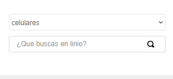
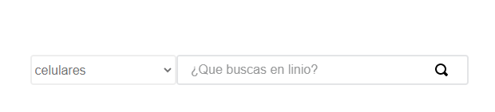
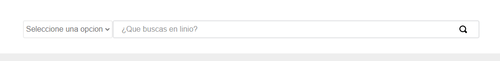

# custom-department-search

Permite buscar un productos filtrando por un departamento

### Mobile



### Tablet



### Desktop



## Configuration

1. Añade a tu `manifest.json` la dependencia `itgloberspartnercl.custom-department-search`;

```json
{
  "itgloberspartnercl.custom-department-search": "0.x"
}
```

2. Para usar el componente solo debe declaralo asi.

## Use

```json
["department-search"]
```

## Customization

| CSS Handles              |
| ------------------------ |
| `search_content`         |
| `search_content_phone`   |
| `search_content_tablet`  |
| `search_content_desktop` |
| `select`                 |
| `select_phone`           |
| `select_tablet`          |
| `select_desktop`         |
